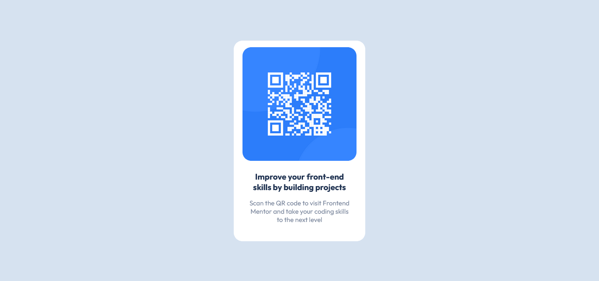

# Frontend Mentor - QR code component solution

This is a solution to the [QR code component challenge on Frontend Mentor](https://www.frontendmentor.io/challenges/qr-code-component-iux_sIO_H). Frontend Mentor challenges help you improve your coding skills by building realistic projects.

## Table of contents

- [Screenshot](#screenshot)
- [Links](#links)
- [Built with](#built-with)
- [What I learned](#what-i-learned)
- [Author](#author)

### Screenshot



### Links

- Solution URL: [https://github.com/mah07308/FM-QR-Code-Component](https://github.com/mah07308/FM-QR-Code-Component)
- Live Site URL: [https://mah07308.github.io/FM-QR-Code-Component/](https://mah07308.github.io/FM-QR-Code-Component/)

### Built with

- HTML5
- CSS

### What I learned

How to center an element both horizontally and vertically without flexbox or grid (code given below). Had some trouble at first but figured it out after doing some research.

```css
.card {
  position: absolute;
  top: 50%;
  left: 50%;
  transform: translate(-50%, -50%);
  background-color: hsl(0, 0%, 100%);
  max-width: 300px;
  border-radius: 20px;
}
```

## Author

- Frontend Mentor - [@mah07308](https://www.frontendmentor.io/profile/mah07308)
